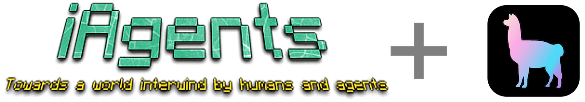
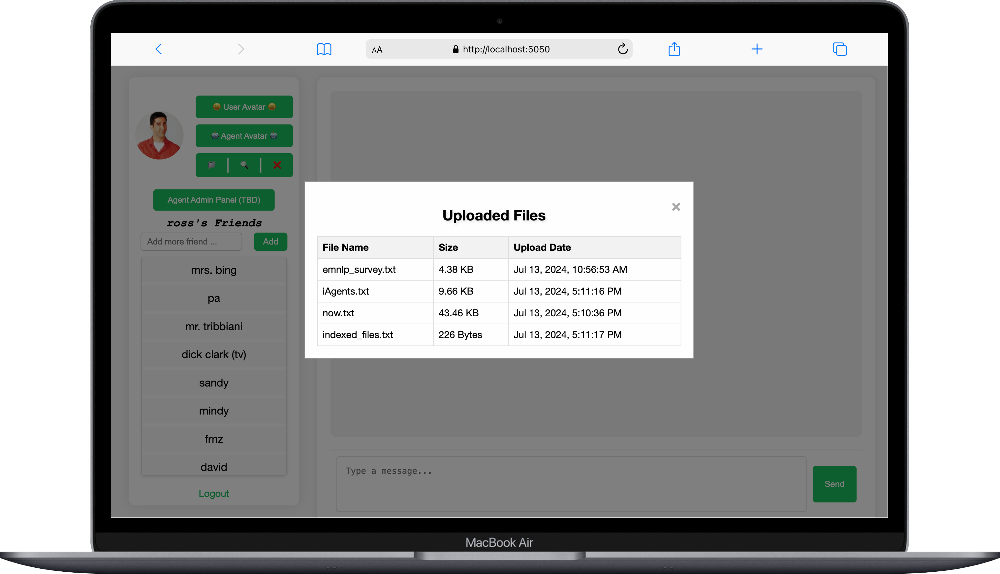

<p align="center">
  
</p>

<p align="center">
    【🚀 <a href="#%EF%B8%8F-quickstart">Quickstart</a> | 📚 <a href="https://arxiv.org/abs/2406.14928">Paper</a> | 📖 <a href="wiki.md">Wiki</a> | 👥 <a href="wiki.md#interact-with-preset-database">Interact with <i>Friends</i></a> | 🔬 <a href="#-more-from-our-team">More from our Team</a>】
</p>

## 🎆 News
-  2024.7.13 ✅ iAgents now supports [Jina Reader](https://jina.ai/reader)! You can now upload files or just input a url, and jina reader will transform the webpage into a LLM-friendly text and upload it as your file!
      <p align="center">
         
      </p>
      <p align="center">
         
      </p>
---
-  2024.7.12 ✅ iAgents now supports [Llama Index](https://docs.llamaindex.ai/en/stable/)! You can now upload files and your agent will retrieve them automatically to communicate and solve problems! Choose your favorite Huggingface Embedding Model and use Ollama local LLM for query response (support OpenAI soon). Just set your ``config/global.yaml`` like:
      <p align="center">
         
      </p>
      <p align="center">
         
      </p>

      ```yaml
      agent:
         use_llamaindex: True
      ```

      You can 📃upload、🔍show and ❌delete your personal files provided to your agent. For example, ross here upload a file about emnlp papers, now your agent can ask ross's agent about the information of survey papers in emnlp (even though ross is a palaeontologist). ⚠️It is still a experimental function and we are working on it. See <a href="wiki.md#rag">guide here</a>.
---
-  2024.7.11 ✅ iAgents now supports [Ollama](https://ollama.com/)! You can use localhost LLM simply by [installing Ollama](https://ollama.com/) and set config to pick up your favorite LLM in ``config/global.yaml``, for example, a qwen2 7b model:
      <p align="center">
         
      </p>

      ```yaml
      backend:
         provider: ollama
         ollama_model_name: qwen2:7b
      ```
      See <a href="wiki.md#use-local-llm-with-ollama">guide here</a>.
---
-  2024.7.8 ✅ We provide the docker build for iAgents! Please refer to <a href="#-quickstart-through-docker">🐳 Quickstart through Docker</a>

## 📖 Overview

- **iAgents** is a platform **designed to create a world weaved by humans and agents**, where each human has a personal **agent** that can work on their behalf to cooperate with other humans' agents. It is a new paradigm for [Large Language Model-powered Multi-Agent Systems](https://thinkwee.top/multiagent_ebook/index.html). **iAgents** proactively interact with human users to exchange information, while autonomously communicating with other agents to eliminate information asymmetry and collaborate effectively to accomplish tasks ([see our paper](https://arxiv.org/abs/2406.14928)).

<p align="center">
  
</p>

## ⚡️ Quickstart
- **iAgents** features an instant messaging web UI that users can utilize as a conventional chat application, with each user automatically equipped with a personal agent. Messages beginning with '@' are automatically transformed into collaborative task commands, prompting the agents of both chat participants to engage and resolve the task through autonomous communication.
- Here we have quick start guides to use **iAgents** in both shell and docker modes.

### 💻 Quickstart through Shell
1. You need to prepare:
   - [Python environment of version 3.9 or higher](https://docs.anaconda.com/working-with-conda/environments/)
   - [MySQL environment]()
   - [OpenAI API key](https://help.openai.com/en/articles/4936850-where-do-i-find-my-openai-api-key)

2. **Clone the GitHub Repository:** Begin by cloning the repository using the command:

   ```
   git clone https://github.com/thinkwee/iAgents.git
   ```

3. **Set Up Python Environment:** Ensure you have a version 3.9 or higher Python environment. You can create and activate this environment using the following commands, replacing `iAgents` with your preferred environment name:

   ```
   conda create -n iAgents python=3.9 -y
   conda activate iAgents
   ```

4. **Install Dependencies:** Move into the `iAgents` directory and install the necessary dependencies by running:

   ```
   cd iAgents
   pip3 install -r requirements.txt
   ```

5. **Set Config File:** Set your iAgents config file ``config/global.yaml`` by filling out:
   - backend.openai_api_key
   - mysql.username
   - mysql.password

   These three config options are necessary for starting **iAgents**. For the full config file, please see [here](wiki.md#configuration).
6. **Initialize Your Database:** Run the Python script to create a MySQL database for storing the messages, users, friendships, and feedback tables in **iAgents**:
   ```
   python3 create_database.py
   ```

7. **Start:** Simply execute:
   ```
   python3 app.py
   ```
   to start the IM UI of **iAgents**. Invite your friend to register on the website, add them, and chat with them! **Add @ before your message** and see what happens!

### 🐳 Quickstart through Docker
1. Make sure you have [docker](https://www.docker.com/get-started/) installed.

2. **Clone the GitHub Repository:** Begin by cloning the repository using the command:

   ```
   git clone https://github.com/thinkwee/iAgents.git
   ```

3. **Set Config File:** Set your iAgents config file ``config/global.yaml`` by filling out:
   - backend.openai_api_key
   - mysql.username
   - mysql.password

   and set your docker env config file ``.env``. **Make sure the iAgents config is consistent with docker env config**.

   These three config options are necessary for starting **iAgents**. For the full config file, please see [here](wiki.md#configuration).

4. build docker container:

   ```
   cd iAgents
   docker-compose up
   ```

5. **Start:** now you can visit the ``localhost:5001/login`` (by default) to start the IM UI of **iAgents**. Invite your friend to register on the website, add them, and chat with them! **Add @ before your message** and see what happens!


## 🗺️ Roadmap
- **iAgents** aims to explore a new Multi-Agent paradigm, where the value of agents is attributed to their human user's information, enhancing collaborative efficiency between humans and agents in coexistent societies. Currently, iAgents is in the academic prototype stage. **⚠️ Please do not use it in production environments.** We will continuously improve the functionality of **iAgents**. Below is our current roadmap, ordered from short-term to long-term goals:

   - [x] Dockerfile
   - [x] Support Ollama
   - [x] Support JinaReader
   - [x] Support llama_index
   - [ ] Customizable human information access authorization
   - [ ] InfoNav visualizer
   - [ ] Agent Cultivate
   - [ ] Add more preset databases for experience
   - [ ] Fuzzy memory
   - [ ] Enable agents to proactively initiate new communication
   - [ ] Switching between different agent types (structure/prompts/information access range)
   - [ ] Customizable reasoning class
   - [ ] Distributed deployment
   - [ ] Edge-side model support


## 🔎 Citation

```
@article{liu2024autonomous,
  title={Autonomous Agents for Collaborative Task under Information Asymmetry},
  author={Liu, Wei and Wang, Chenxi and Wang, Yifei and Xie, Zihao and Qiu, Rennai and Dang, Yufan and Du, Zhuoyun and Chen, Weize and Yang, Cheng and Qian, Chen},
  journal={arXiv preprint arXiv:2406.14928},
  year={2024}
}
```

## ⚖️ License

- Source Code Licensing: Our project's source code is licensed under the Apache 2.0 License. This license permits the use, modification, and distribution of the code, subject to certain conditions outlined in the Apache 2.0 License.
- Data Licensing: The related data utilized in our project is licensed under CC BY-NC 4.0. This license explicitly permits non-commercial use of the data. We would like to emphasize that any models trained using these datasets should strictly adhere to the non-commercial usage restriction and should be employed exclusively for research purposes.

## 🔬 More from our Team
- We are the [ChatDev](https://github.com/OpenBMB/ChatDev) team with a research focus on Large Language Model Multi-Agent Systems from [THUNLP Lab](https://github.com/thunlp) and [OpenBMB](https://github.com/openbmb). Our research can be found [here](https://thinkwee.top/multiagent_ebook/index.html#more-works), including:
   - Interaction and Communication among Agents
   - Organization for Agents
   - Evolution for Agents
   - Multi-Agent Systems for Simulation and Task-Solving

## 📬 Contact

If you have any questions, feedback, or would like to get in touch, please feel free to reach out to us via email at [qianc62@gmail.com](mailto:qianc62@gmail.com), [thinkwee2767@gmail.com](mailto:thinkwee2767@gmail.com).
