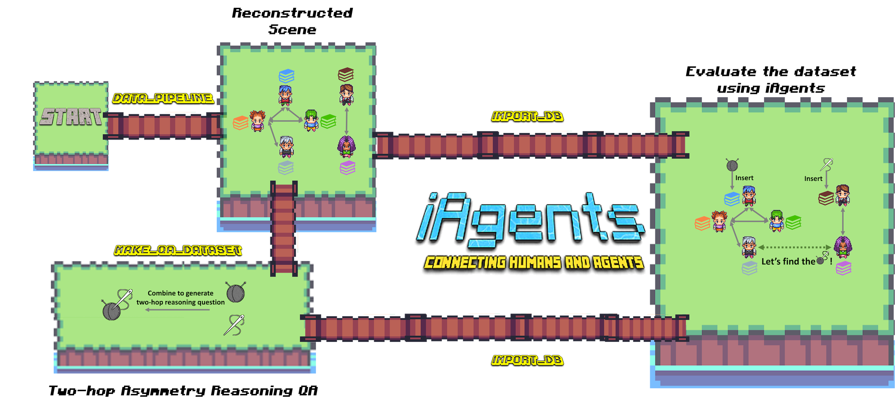

# *FriendsTV* Dataset

<p align="center">
  
</p>


This repository contains the whole pipeline for constructing the FriendsTV dataset in the paper. 

## Features

- Complete script for Friends Season 1
- Each line of dialogue is annotated with:
  - Speaker (who is saying the line)
  - Listener(s) (who the line is directed to)
- Reconstructed scene structure for the entire first season
- A human-in-the-loop approach to construct a high-quality information asymmetry QA dataset

## Pipeline

1. Scene Reconstruction and Dialogue Annotation
   ```
   python3 friends_data_pipeline.py <season> <episode>
   ```
   - Starts with the raw script from `Friends.csv`
   - Reconstructs scenes for a specified season and episode
   - Converts script to dialogue format
   - Uses GPT to annotate dialogue with sender and receiver
   - Applies extensive rules and post-processing
   - Outputs annotated script as `s<season>.csv`

   **Note: This step is token-intensive. We provide annotated script for Season 1 (`s01.csv`).** Users can annotate other seasons/episodes if they have their own LLM API.

   Example usage for Season 7, Episode 3:
   ```
   python3 friends_data_pipeline.py 07 03
   ```

2. QA Dataset Construction
   ```
   python3 make_qa_dataset.py
   ```
   - Requires downloading the FriendsQA dataset
   - Selects suitable scenes and one-hop reasoning questions
   - Constructs two-hop reasoning questions
   - Implements human-in-the-loop approach:
     - User decides if current scene and one-hop question are suitable for synthesis
     - GPT generates two-hop questions
     - User accepts or rejects the synthesis
     - Good syntheses can be added as in-context examples for future generations
   - Outputs `FriendsComQA.jsonl`, the two-hop reasoning dataset

3. Database Import
   ```
   python3 friends_import_db.py
   ```
   - Imports dialogue dataset from step 1 into iAgents database
   - Recommended: Import provided `FriendsTV.sql` directly

Note: All scripts require proper configuration of the iAgents README for LLM backend usage.

