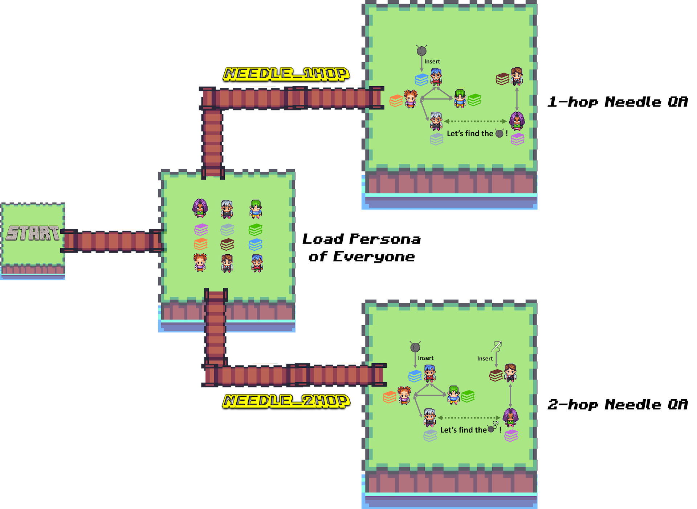

# iAgents *Needle in the Persona Dataset* Pipeline

<p align="center">
  
</p>

This project generates a dataset of persona-based conversations with hidden information (needles) that need to be discovered through dialogue. The dataset is based on the `google/Synthetic-Persona-Chat` dataset.

## Overview

The project consists of two main components:

1. `needle_1hop.py`: Generates one-hop questions
2. `needle_2hop.py`: Generates two-hop questions

Both scripts use the `google/Synthetic-Persona-Chat` dataset as a foundation and employ GPT-4 to generate and modify conversations.

## needle_1hop.py

This script generates one-hop questions by inserting a "needle" of information into one persona and creating a conversation where the other participant must discover this information.

Process:
1. Loads personas and conversations from the Synthetic-Persona-Chat dataset.
2. Selects a random piece of information (needle) from a persona.
3. Inserts this needle into Person A's persona.
4. Generates a conversation between Person A and Person B, where B tries to discover the needle information from A.
5. Creates a task prompt (question) related to the needle information.
6. Saves the generated sample, including the modified conversation, task prompt, and answer.

## needle_2hop.py

This script generates two-hop questions by inserting a common "needle" of information into two personas and creating separate conversations that reveal different aspects of this shared information.

Process:
1. Loads personas and conversations from the Synthetic-Persona-Chat dataset.
2. Selects random personas and conversations for four participants: Alice, Bob, Charlie, and Dave.
3. Generates a common persona (needle) that is added to both Alice and Dave's personas, either in the same way or differently.
4. Modifies the conversation between Alice and Bob to include Alice's part of the new persona.
5. Modifies the conversation between Charlie and Dave to include Dave's part of the new persona.
6. Generates a new conversation between Bob and Charlie.
7. Creates a task prompt (question) related to the common persona.
8. Saves the generated sample, including all modified conversations, task prompt, and answer.

## Usage

To generate the dataset, run the following commands:
```
python needle_1hop.py
python needle_2hop.py
```

## Dataset

The dataset is saved in JSONL format and can be used for evaluating **iAgents**.
