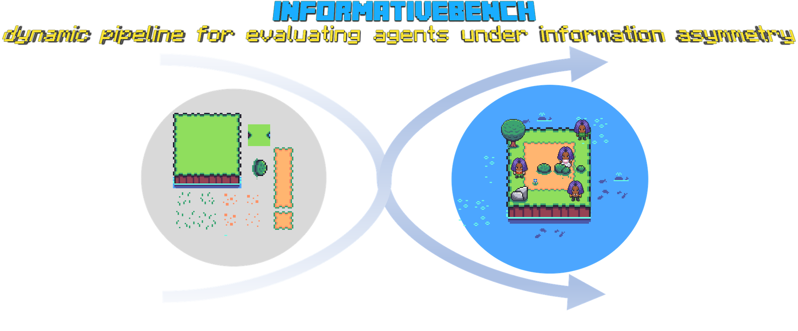

# *informativeBench*

  

informativeBench is a comprehensive benchmark designed to evaluate language models and agents in information-asymmetric collaborative environments. It consists of three distinct datasets:

1. FriendsTV
2. Needle in the Persona
3. Schedule

## Overview

Each dataset in informativeBench is carefully crafted to test different aspects of information retrieval, reasoning, and collaboration in scenarios where information is unevenly distributed among participants.

## Importance of Dynamic Benchmarking

It's crucial to note that large language models can easily memorize benchmarks, leading to data contamination and leakage. This can result in artificially inflated performance metrics that don't accurately reflect a model's true capabilities.

To address this issue, we've open-sourced our data generation pipelines. This approach allows users to dynamically construct benchmarks tailored to their specific needs, ensuring a more accurate evaluation of their language models and agents in information-asymmetric collaborative environments.

## Dataset Pipelines

Each dataset folder contains a detailed README with instructions on how to generate and customize the data:

- [FriendsTV Pipeline](./FriendsTV/README.md)
- [Needle in the Persona Pipeline](./Needle_in_the_Persona/README.md)
- [Schedule Pipeline](./Schedule/README.md)

By using these pipelines, you can create unique, contamination-free datasets to robustly evaluate your models and agents.

