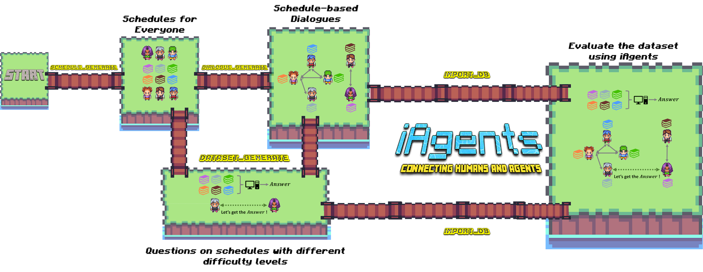

# iAgents *Schedule Dataset* Pipeline

This README outlines the process of generating the Schedule dataset, which includes creating schedules, generating dialogues, and producing datasets of varying difficulty levels.

## Pipeline Overview

1. Generate schedules for multiple people
2. Create dialogues based on the generated schedules
3. Generate datasets (easy, medium, and hard) using schedules and dialogues
4. Import dialogues into a database

After that, you can open **iAgents** platform to see the imported dialogues among people, and evaluate using the datasets with different difficulty levels.

## Step-by-Step Process

### 1. Generate Schedules (schedule_generate.py)

This script creates schedules for a group of people:

- Generates random activities for each person
- Adds routine activities (sleep, lunch)
- Schedules shared activities between people
- Outputs the schedules to 'schedule_data_list.jsonl'

### 2. Generate Dialogues (dialogue_generate.py)

Using the generated schedules, this script creates conversations between pairs of people:

- Reads schedules from 'schedule_data_list.jsonl'
- Query LLM to generate dialogues among people based on the schedules
- Outputs the dialogues to 'dialogue.csv'

### 3. Generate Datasets

Three scripts generate datasets of varying difficulty levels:

- dataset_generate_easy.py: Creates easy-level questions
- dataset_generate_medium.py: Creates medium-level questions
- dataset_generate_hard.py: Creates hard-level questions

Each script:
- Reads schedules from 'schedule_data_list.jsonl'
- Reads dialogues from 'dialogue.csv'
- Generates questions and answers based on the schedules and dialogues
- Outputs the datasets to JSONL files (dataset_easy.jsonl, dataset_medium.jsonl, dataset_hard.jsonl)

### 4. Import Dialogues to Database (Schedule_import_db.py)

This script imports the generated dialogues into a MySQL database:

- Creates necessary database tables (users, friendships, chats)
- Reads dialogues from 'dialogue.csv'
- Inserts data into the database tables

## Usage

To generate the complete dataset:

1. Run schedule_generate.py
2. Run dialogue_generate.py
3. Run dataset_generate_easy.py, dataset_generate_medium.py, and dataset_generate_hard.py
4. (Optional) Run Schedule_import_db.py to import dialogues into a database

**Note**: 
-   Ensure all required dependencies are installed and database configurations are set up correctly before running the scripts.
-   Adjust scale in all these scripts, which means the number of samples to generate.
