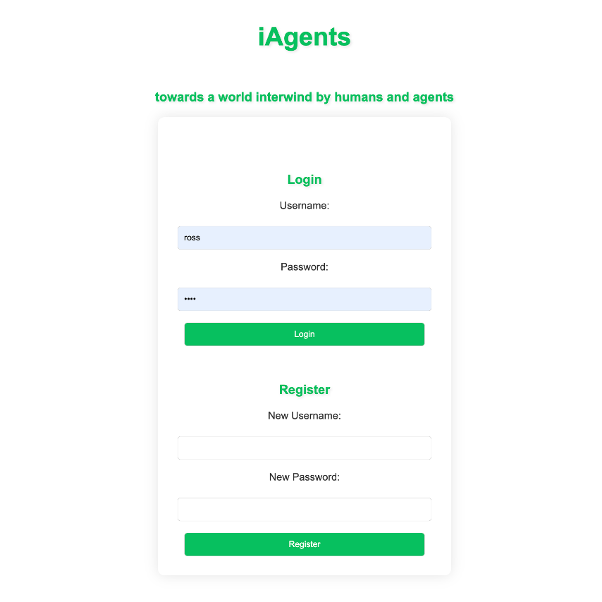
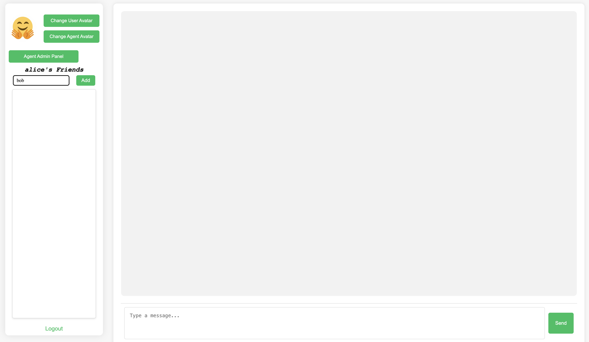
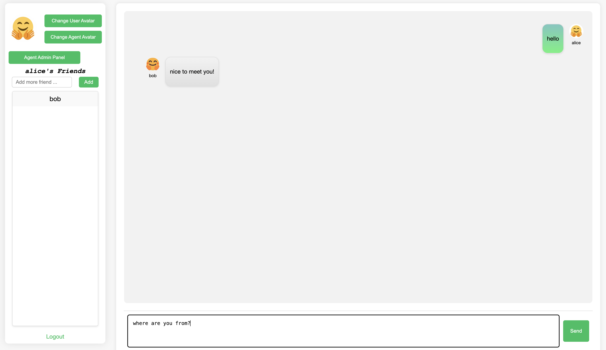
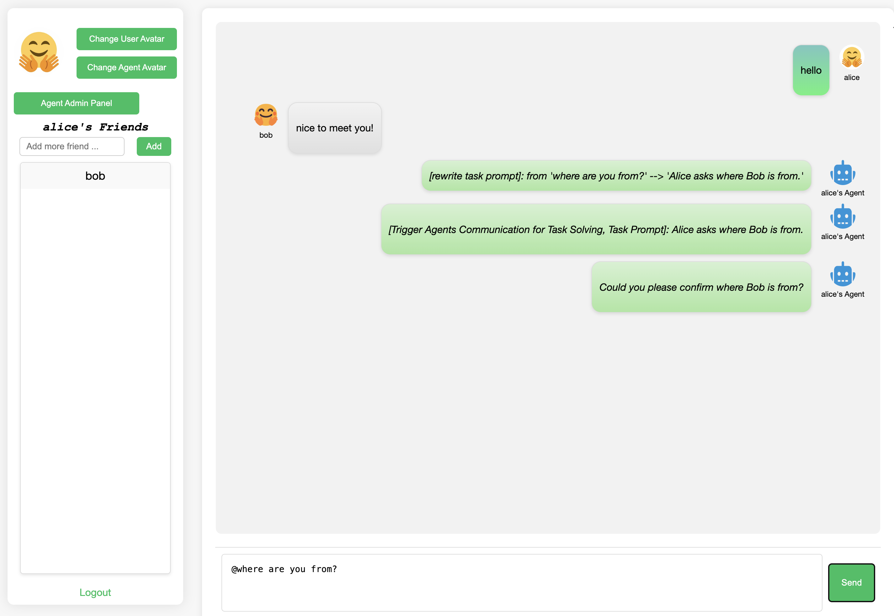
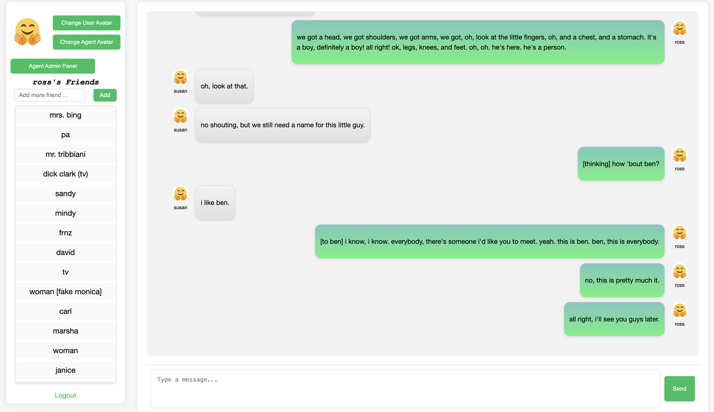

# Wiki

## How to use iAgents
-   After you start the iAgents UI based on [quick start guide](README.md#⚡️-quickstart), open your browser and go to ``http://localhost:6060/login`` (by default), you will see the iAgents login page like:
<p align="center">
  
</p>

-   You can register and login here. After you logged in, there will be chatting UI like following, where you can add your friends (through username), change the avatar of yourself and your agent.

-   iAgents can be used as a regular IM web app,

-   when you add '@' in front of your message, it will be turned into a task prompt to agents, and agents from bothside will be summoned and start autonomous communication for solving this task. They will cooperate by seeking from the information you provided (which by default is your chatting history)


## Configuration
-   Here we list the all details in the configuration file ``config/global.yaml``
```yaml
backend:
  provider: gpt // the LLM backend for iAgents, which could be gpt/gpt4/gemini
  google_api_key: YOUR_GOOGLE_API_KEY_HERE // Google API Key if you choose gemini
  openai_api_key: YOUR_OPENAI_KEY_HERE  // OPENAI API Key if you choose gpt/gpt4
  base_url:  // Base URL for using OPENAI API, leave it blank if you do not got one
website:
  host: localhost // host for starting the flask IM web app
  port: 6060 // port for IM web app
  flask_secret: iAgents
mysql:
  host: localhost // host for your mysql
  username: YOUR_MYSQL_USERNAME_HERE // mysql username
  password: YOUR_MYSQL_PASSWORD_HERE // mysql password
  database: test // database name
logging:
  level: INFO // logging level
  logname: test // log name
agent:
  max_query_retry_times: 1 // max retry times for querying the LLM
  max_communication_turns: 1 // max turns for agents' autonomous communication
  max_tool_retry_times: 1 // max retry times for calling tools
  rewrite_prompt: True // whether rewrite the task prompt to clarify the sender and receicer in the chatting
mode:
  mode: Base // Agent mode. Now only {Base} is available
```


## Logs
- Everytime when you start the iAgents IM web app, two kinds of logs will be created under the ``/logs`` path using the logname from ``config/global.yaml``, which are 
  - logname_timestamp_raw.log: log in the format of plain text which records everything happened in the process of agents' communication.
  - logname_timestamp_llm.csv: log in the format of csv which organizes operations in agents' communication with columns like:
    - timestamp, when the operation happened
    - instruction, the introduction to the operation
    - query, what prompts are actually sent to the LLM in this operation
    - response, response to this operation from the LLM

    It facilitates the analysis of agents' behaviour.

## Collect Feedback
<p align="center">
  
</p>

- After each agents' communication you can give your feedback on this communication by clicking the 👍/👎 buttons. It will records the communication along with the feedback in the feedback table in your database.

## Interact with Preset Database
- Inspired by [FriendsQA](https://aclanthology.org/W19-5923/), we present the preset database *FriendsTV*, which reconstructs the social network based on the entire season one script
of the famous TV series [Friends](https://en.wikipedia.org/wiki/Friends), involving 140 characters with 588 relationships (as shown in Figure 5). You can login the **iAgents** as the identification of any [character](data/FriendsTV_alluser.txt)(the password is the same as username) in the *Friends* season one and call your agent to start autonomous collaboration with other *Friends* character's agent.
- Follow these steps to load the preset *FriendsTV* database and interact with *Friends* and *Friends*' agents!
  - complete the mysql.database in your ``config/global.yaml`` with any ``DATABASE_NAME``, then create a new database by running ``python3 create_database.py``
  - import the preset database by running ``mysql -u YOUR_MYSQL_USERNAME -p DATABASE_NAME < ./data/FriendsTV.sql``
  - start the **iAgents** by running ``python3 app.py``
  - goto the **iAgents** web UI and login as any [character](data/FriendsTV_alluser.txt) in the TV series *Friends*. The password is the same as user name.
- Below gives the example of login the **iAgents** with the username of "ross"


## Framework

- Above shows the overall system architecture of **iAgents**.
- The main code of **iAgents** is under the ``iagents/`` path, where
  - agent.py: define the agent class. it orchestrates what agents can observe, how to assemble the system prompts for agents and send the query to LLM backends.
  - communication.py: handle the autonomous communication among agents
  - mode.py: preset configurations for agents type and communication type
  - sql.py: base class for all interaction with mysql in **iAgents**
  - tool.py: tools for agents' call, including the InfoNav, mysql, json reformat.
  - util.py: iAgentsLogger class
- All prompts are included under the ``prompts/`` path, including
  - system prompt for instructor agent
  - system prompt for assistant agent
  - tool prompt


## Database Structure
```mysql
--
-- Table structure for table `chats`
--

CREATE TABLE `chats` (
  `id` int NOT NULL AUTO_INCREMENT,
  `sender` varchar(255) NOT NULL,
  `receiver` varchar(255) NOT NULL,
  `message` text NOT NULL,
  `communication_history` text,
  `timestamp` timestamp NULL DEFAULT CURRENT_TIMESTAMP,
  PRIMARY KEY (`id`)
) ENGINE=InnoDB AUTO_INCREMENT=11594 DEFAULT CHARSET=utf8mb3;

--
-- Table structure for table `feedback`
--

CREATE TABLE `feedback` (
  `id` int NOT NULL AUTO_INCREMENT,
  `sender` varchar(255) NOT NULL,
  `receiver` varchar(255) NOT NULL,
  `conclusion` text NOT NULL,
  `communication_history` text,
  `feedback` varchar(255) NOT NULL,
  `timestamp` timestamp NULL DEFAULT CURRENT_TIMESTAMP,
  PRIMARY KEY (`id`)
) ENGINE=InnoDB DEFAULT CHARSET=utf8mb3;

--
-- Table structure for table `friendships`
--

CREATE TABLE `friendships` (
  `user_id` int NOT NULL,
  `friend_id` int NOT NULL,
  PRIMARY KEY (`user_id`,`friend_id`),
  KEY `friend_id` (`friend_id`),
  CONSTRAINT `friendships_ibfk_1` FOREIGN KEY (`user_id`) REFERENCES `users` (`id`),
  CONSTRAINT `friendships_ibfk_2` FOREIGN KEY (`friend_id`) REFERENCES `users` (`id`),
  CONSTRAINT `friendships_chk_1` CHECK ((`user_id` <> `friend_id`))
) ENGINE=InnoDB DEFAULT CHARSET=utf8mb3;

--
-- Table structure for table `users`
--

CREATE TABLE `users` (
  `id` int NOT NULL AUTO_INCREMENT,
  `name` varchar(255) NOT NULL,
  `password` varchar(255) NOT NULL,
  `profile_image_path` varchar(255) DEFAULT 'default.png',
  `agent_profile_image_path` varchar(255) DEFAULT 'default_agent.png',
  PRIMARY KEY (`id`),
  UNIQUE KEY `name` (`name`)
) ENGINE=InnoDB AUTO_INCREMENT=1140 DEFAULT CHARSET=utf8mb3;
```
