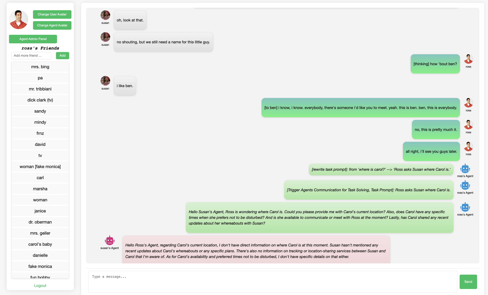
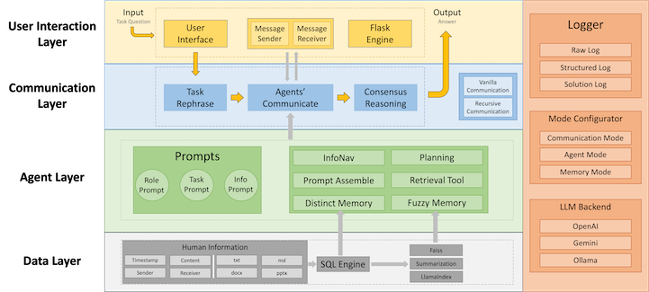

# Wiki

## How to use iAgents

- After you start the iAgents UI based on the [quick start guide](README.md#⚡️-quickstart), open your browser and go to `http://localhost:6060/login` (by default), you will see the iAgents login page like this:
<p align="center">
  
</p>

- You can register and log in here. After you log in, there will be a chatting UI like the following, where you can add your friends (through their username), and change the avatar of yourself and your agent.

- iAgents can be used as a regular IM web app,

- When you add '@' in front of your message, it will be turned into a task prompt to agents, and agents from both sides will be summoned and start autonomous communication for solving this task. They will cooperate by seeking from the information you provided (which by default is your chat history).


## Use Local LLM with Ollama
- Follow the instructions on [Ollama](https://ollama.com/) to install and start Ollama. We recommend first try Ollama in shell with your favorite opensource LLM to test if your device support a local LLM, for example, run 
  ```bash
  ollama run qwen2:7b
  ```
  It will download the modelfile of qwen2 7b and start an interactive shell for chatting.
- Run iAgents with Ollama does not need the interactive shell activated but only leave the Ollama running in background. Then change your ``config/global.yaml`` with your tested and downloaded local LLM:
  ```yaml
  backend:
      provider: ollama
      ollama_model_name: qwen2:7b
  ```
  Then you can start iAgents and run all agents with this local LLM.

## RAG
- iAgents allows human user provide files and information to their agent for personalized automatic communication and cooperation. Vanilla iAgents has supported to use chatting history as human information. With RAG ability of iAgents, you can upload any file and even website to enrich your personal information.
- iAgents uses [Llama Index](https://docs.llamaindex.ai/en/stable/) to achieve RAG. The dependency has been recorded in ``requirements.txt`` so all you have to do is to install iAgents as usual.
- In the chatting UI you will see the RAG toolbar like:

  <p align="center">
    
  </p>

  where 📃 for uploading files, 🔍 for showing all files uploaded, ❌ for deleting all files. When uploading files, you can also choose to input a url instead, and iAgents will use [Jina Reader](https://jina.ai/reader) to parse this website into a LLM-friendly text and save it as your file:

  <p align="center">
    
  </p>  
  
- You can always upload file but only when option in ``config/global.yaml`` is the set to True then your agent will try to read your file:
  ```yaml
  agent:
      use_llamaindex: True
  ``` 
- The whole process of RAG is like
  - upload a file (or parse a file from url)
  - chunk this file and embed this file with Llama Index, using ``BAAI/bge-small-en-v1.5`` for the embedding model by default
  - Then everytime when your agent start planning, it will try to query your embeded files and get a response from your Ollama local LLM. Then the response will serve as the context for the agent to make decision in each utterance.

## Configuration

- Here we list all the details in the configuration file `config/global.yaml`:
```yaml
backend:
  provider: gpt // the LLM backend for iAgents, which could be gpt/gpt4/gemini
  google_api_key: YOUR_GOOGLE_API_KEY_HERE // Google API Key if you choose gemini
  openai_api_key: YOUR_OPENAI_KEY_HERE  // OPENAI API Key if you choose gpt/gpt4
  base_url:  // Base URL for using OPENAI API, leave it blank if you do not have one
website:
  host: localhost // host for starting the Flask IM web app
  port: 6060 // port for IM web app
  flask_secret: iAgents
mysql:
  host: localhost // host for your MySQL
  username: YOUR_MYSQL_USERNAME_HERE // MySQL username
  password: YOUR_MYSQL_PASSWORD_HERE // MySQL password
  database: test // database name
logging:
  level: INFO // logging level
  logname: test // log name
agent:
  max_query_retry_times: 1 // max retry times for querying the LLM
  max_communication_turns: 1 // max turns for agents' autonomous communication
  max_tool_retry_times: 1 // max retry times for calling tools
  rewrite_prompt: True // whether to rewrite the task prompt to clarify the sender and receiver in the chat
mode:
  mode: Base // Agent mode. Now only {Base} is available
```

## Logs

- Every time you start the iAgents IM web app, two kinds of logs will be created under the `/logs` path using the logname from `config/global.yaml`:
  - logname_timestamp_raw.log: log in the format of plain text which records everything that happened in the process of agents' communication.
  - logname_timestamp_llm.csv: log in the format of CSV which organizes operations in agents' communication with columns like:
    - timestamp: when the operation happened
    - instruction: the introduction to the operation
    - query: what prompts are actually sent to the LLM in this operation
    - response: response to this operation from the LLM

    It facilitates the analysis of agents' behavior.

## Collect Feedback
<p align="center">
  
</p>

- After each agents' communication, you can give your feedback on this communication by clicking the 👍/👎 buttons. It will record the communication along with the feedback in the feedback table in your database.

## Interact with Preset Database

- Inspired by [FriendsQA](https://aclanthology.org/W19-5923/), we present the preset database *FriendsTV*, which reconstructs the social network based on the entire season one script of the famous TV series [Friends](https://en.wikipedia.org/wiki/Friends), involving 140 characters with 588 relationships (as shown in Figure 5). You can log in to **iAgents** as the identification of any [character](data/FriendsTV/FriendsTV_alluser.txt) (the password is the same as the username) in the *Friends* season one and call your agent to start autonomous collaboration with other *Friends* characters' agents.
- Follow these steps to load the preset *FriendsTV* database and interact with *Friends* and *Friends*' agents!
  - Complete the mysql.database in your `config/global.yaml` with any `DATABASE_NAME`, then create a new database by running `python3 create_database.py`
  - Import the preset database by running `mysql -u YOUR_MYSQL_USERNAME -p DATABASE_NAME < ./data/FriendsTV/FriendsTV.sql`
  - Start **iAgents** by running `python3 app.py`
  - Go to the **iAgents** web UI and log in as any [character](data/FriendsTV/FriendsTV_alluser.txt) in the TV series *Friends*. The password is the same as the username.
- Below is an example of logging in to **iAgents** with the username "ross":


## Framework
<p align="center">
  
</p>
- Above is the overall system architecture of **iAgents**.
- The main code of **iAgents** is under the `iagents/` path, where:
  - agent.py: defines the agent class. It orchestrates what agents can observe, how to assemble the system prompts for agents, and send the query to LLM backends.
  - communication.py: handles the autonomous communication among agents
  - mode.py: preset configurations for agent types and communication types
  - sql.py: base class for all interactions with MySQL in **iAgents**
  - tool.py: tools for agents' calls, including InfoNav, MySQL, JSON reformat
  - util.py: iAgentsLogger class
- All prompts are included under the `prompts/` path, including:
  - system prompt for instructor agent
  - system prompt for assistant agent
  - tool prompt

## Database Structure

```mysql
--
-- Table structure for table `chats`
--

CREATE TABLE `chats` (
  `id` int NOT NULL AUTO_INCREMENT,
  `sender` varchar(255) NOT NULL,
  `receiver` varchar(255) NOT NULL,
  `message` text NOT NULL,
  `communication_history` text,
  `timestamp` timestamp NULL DEFAULT CURRENT_TIMESTAMP,
  PRIMARY KEY (`id`)
) ENGINE=InnoDB AUTO_INCREMENT=11594 DEFAULT CHARSET=utf8mb3;

--
-- Table structure for table `feedback`
--

CREATE TABLE `feedback` (
  `id` int NOT NULL AUTO_INCREMENT,
  `sender` varchar(255) NOT NULL,
  `receiver` varchar(255) NOT NULL,
  `conclusion` text NOT NULL,
  `communication_history` text,
  `feedback` varchar(255) NOT NULL,
  `timestamp` timestamp NULL DEFAULT CURRENT_TIMESTAMP,
  PRIMARY KEY (`id`)
) ENGINE=InnoDB DEFAULT CHARSET=utf8mb3;

--
-- Table structure for table `friendships`
--

CREATE TABLE `friendships` (
  `user_id` int NOT NULL,
  `friend_id` int NOT NULL,
  PRIMARY KEY (`user_id`,`friend_id`),
  KEY `friend_id` (`friend_id`),
  CONSTRAINT `friendships_ibfk_1` FOREIGN KEY (`user_id`) REFERENCES `users` (`id`),
  CONSTRAINT `friendships_ibfk_2` FOREIGN KEY (`friend_id`) REFERENCES `users` (`id`),
  CONSTRAINT `friendships_chk_1` CHECK ((`user_id` <> `friend_id`))
) ENGINE=InnoDB DEFAULT CHARSET=utf8mb3;

--
-- Table structure for table `users`
--

CREATE TABLE `users` (
  `id` int NOT NULL AUTO_INCREMENT,
  `name` varchar(255) NOT NULL,
  `password` varchar(255) NOT NULL,
  `profile_image_path` varchar(255) DEFAULT 'default.png',
  `agent_profile_image_path` varchar(255) DEFAULT 'default_agent.png',
  PRIMARY KEY (`id`),
  UNIQUE KEY `name` (`name`)
) ENGINE=InnoDB AUTO_INCREMENT=1140 DEFAULT CHARSET=utf8mb3;
```